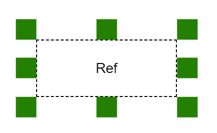

<p align="center">
  <a href='https://jsbin.com/beqosub/edit?html,css,output' title='See demo'><a/>
  <br><br>
  <a href='https://www.npmjs.com/package/@yaireo/position'>
      
  </a>
  
  
</p>

<h1 align="center">
  Position DOM element at X,Y or next to another element
</h1>

## Install

```bash
npm i @yaireo/position -S
```

### UMD file link:

    https://unpkg.com/@yaireo/position

## Example
```js
import position from '@yaireo/position'

position({
  // the element wished to be positioned in a certain place
  target: targetElement,

  // reference DOM element or an Object like so: {x:10, y:20}
  ref: refElement,

  // [optional] default target plaement string, relative to the ref
  // first string value is horizontal and then vertical placement. Examples:
  // 'left center', 'right below', 'center center'
  placement:'center above',

  // [optional] distance from reference element
  offset: [20],

  // [optional] by default the positioning updates within a RequestAnimationFrame callback,
  //but this can cause painting delays when resizing or scrolling fast.
  useRaf: false,
})
```

This scripts places an element next to another element (at a certain prefered relative place).
If you want to update the targer's position (relative to its referece node) when the page scrolls or resizes
I advice adding observers:

```js
const observerCallback = () => position({ target:targetElement, ref:refElement })

// create observers instances
const resizeObserver = new ResizeObserver(observerCallback)
const intersectionObserver = new IntersectionObserver(observerCallback, {root:document, threshold:1})

// start observing (using the instances created above)
resizeObserver.observe(document.body)
intersectionObserver.observe(targetElement)
```

## CSS

This script adds *CSS variables* (custom properties) on the *target* element:

| CSS Variable        |
| ------------------- |
| `pos-left`          |
| `pos-top`           |
| `pos-target-width`  |
| `pos-target-height` |
| `pos-ref-width`     |
| `pos-ref-height`    |
| `pos-ref-left`      |
| `pos-ref-top`       |
| `window-scroll-y`   |
| `window-scroll-x'`  |

Using the above mix of variables, write this CSS in your code to position the target:

```css
[positioned]{
  --x: calc(var(--pos-left) + var(--window-scroll-x));
  --y: calc(var(--pos-top) + var(--window-scroll-y));
  position: absolute;
  z-index: 999999;
  top: 0;
  left: 0;
  transform: translate(calc(var(--x) * 1px),
                       calc(var(--y) * 1px));
}
```
